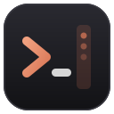
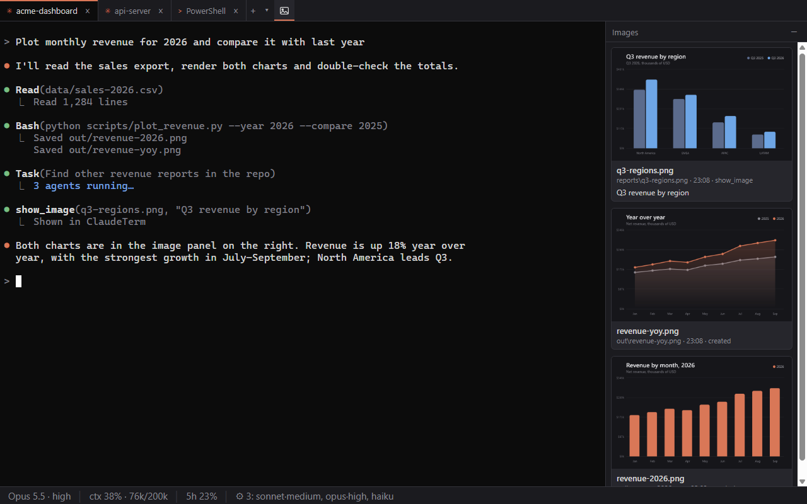
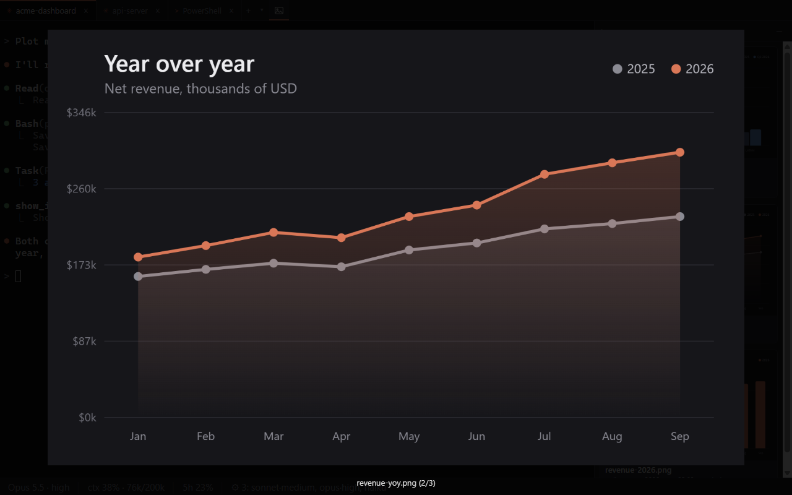
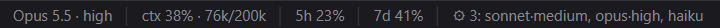
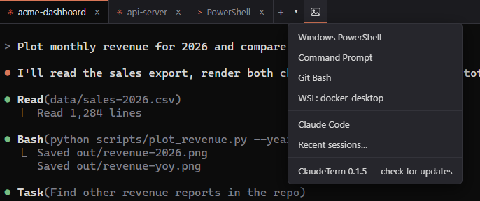
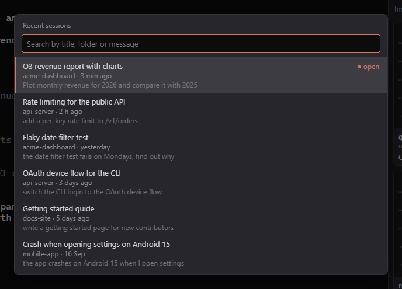
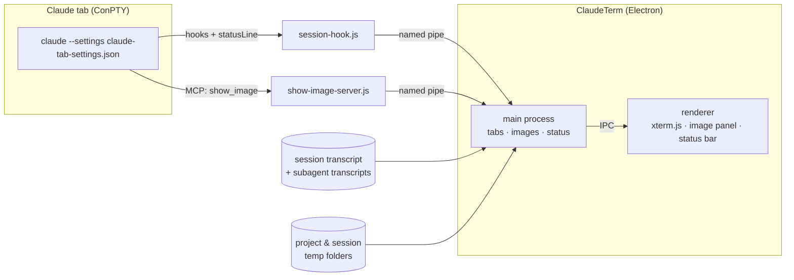

<p align="center">
  
</p>

<h1 align="center">ClaudeTerm</h1>

<p align="center">
  <b>A Windows terminal built for Claude Code.</b><br>
  Tabs for every shell, every image of the conversation in a side panel,<br>
  a live status bar for model, context, limits and subagents — and your sessions back after a reboot.
</p>

<p align="center">
  <a href="https://github.com/DmVergasov/ClaudeTerm/actions/workflows/ci.yml"></a>
  <a href="https://github.com/DmVergasov/ClaudeTerm/releases/latest"></a>
  
  <a href="LICENSE"></a>
</p>

<p align="center">
  <a href="https://github.com/DmVergasov/ClaudeTerm/releases/latest"><b>Download for Windows</b></a>
  ·
  <a href="#features">Features</a>
  ·
  <a href="#keyboard-shortcuts">Shortcuts</a>
  ·
  <a href="#settings">Settings</a>
  ·
  <a href="CONTRIBUTING.md">Contributing</a>
</p>

<p align="center">
  
  <br>
  <sub>Screenshots use demo data.</sub>
</p>

## Features

### 🖼️ Every image of the conversation, right next to it

Claude Code works with images all the time — browser screenshots, charts it plots, files it reads, pictures you paste. In a plain terminal you never see them. ClaudeTerm puts them in a panel beside each Claude tab, the way the Claude mobile app does:

- **From the conversation** — screenshots returned by tools and MCP servers, images Claude opens with `Read`, images you paste, including those of subagents. On `--resume` the panel fills with the conversation's history.
- **Files Claude creates** — new and changed images in the project folder and in the session's temp folder.
- **On request** — the bundled `show_image` MCP tool lets Claude put any image in front of you with a caption.

Click a card to open it full-size (wheel to zoom, drag to pan, arrows to flip); right-click to open it in a viewer, reveal it in Explorer, copy the image or its path, or insert the path into the prompt.

<p align="center"></p>

### 📊 A status bar that answers "how much is left?"

Under every Claude tab: the current model and reasoning effort, how full the context window is, how much of the 5-hour and weekly usage limits is spent, and which subagents are running right now with their model and effort. Hover for exact token counts, when each limit resets, and a list of the agents with their tasks.

<p align="center"></p>

The limits are shown for Claude Pro and Max subscriptions, where Claude Code reports them.

### 🔔 Know when Claude is waiting for you

When Claude asks for a permission, asks you a question or finishes its turn while you are looking elsewhere, ClaudeTerm plays the Windows default sound, flashes its taskbar button and marks the tab. Nothing happens while that tab is in front of you. The sound can be turned off or replaced with your own `.wav` in the settings.

### 🗂️ A real terminal, with tabs

- **Shell profiles detected automatically** — PowerShell 7, Windows PowerShell, Command Prompt, Git Bash and every WSL distribution, plus your own profiles.
- **Claude tabs** — `claude` runs inside your shell of choice, and you stay in that shell when it exits.
- **Proper Windows terminal behaviour** — ConPTY, GPU rendering via xterm.js, Unicode, clickable links, search, drag & drop of files, smart `Ctrl+C` / `Ctrl+V` (pasting an image hands it to Claude), `Shift+Enter` for a new line in the prompt.
- **Font sizes in points**, exactly like Windows Terminal — `12` looks the same in both.

<p align="center"></p>

### 📂 Open Claude Code here

Right-click any folder (or the background of a folder) in Explorer → **Open Claude Code here**. A Claude tab opens in the running ClaudeTerm window — or ClaudeTerm starts if it isn't running. On Windows 11 the item is under **Show more options**.

### 🔁 Continue previous sessions

Rebooted or closed the window? On the next start ClaudeTerm offers to reopen the same tabs, and **each Claude tab resumes its own conversation** (`claude --resume <session>`), even when several of them ran in the same folder or you used `/clear` in between.

**Recent sessions** (`Ctrl+Shift+H`, or **Recent sessions…** in the ▾ menu) lists your latest Claude Code conversations from every project — also ones started outside ClaudeTerm — with their titles, folders and last messages. Type to filter, Enter to continue one: ClaudeTerm opens a Claude tab in that folder with `claude --resume`, or switches to the tab that already has it.

<p align="center"></p>

## Install

1. Install [Claude Code](https://docs.claude.com/en/docs/claude-code) so that `claude` is on your `PATH`.
2. Download `ClaudeTerm-Setup-<version>.exe` from the [latest release](https://github.com/DmVergasov/ClaudeTerm/releases/latest) and run it. It installs for the current user — no admin rights needed.

> [!NOTE]
> The installer is not code-signed yet, so Windows SmartScreen may warn about it: click **More info → Run anyway**.

From version 0.1.3 on, ClaudeTerm updates itself: it downloads a new release in the background and offers to restart into it, reopening your tabs and Claude conversations. Earlier versions need a one-time manual install. The ▾ menu next to the tabs has **ClaudeTerm <version> — check for updates** to check right away.

On its first start ClaudeTerm registers its `claudeterm` MCP server (the `show_image` tool) with Claude Code at user scope. Uninstalling removes the Explorer menu item and the MCP registration.

**Requirements:** Windows 10 or 11 (x64) and Claude Code.

## Keyboard shortcuts

| Action | Shortcut |
|---|---|
| New tab (default profile) | `Ctrl+Shift+T` |
| New Claude tab in the current tab's folder | `Ctrl+Shift+L` |
| Close tab | `Ctrl+Shift+W` |
| Next / previous tab | `Ctrl+Tab` / `Ctrl+Shift+Tab` |
| Go to tab 1–9 | `Ctrl+Alt+1` … `Ctrl+Alt+9` |
| Copy / paste | `Ctrl+Shift+C` / `Ctrl+Shift+V` |
| Copy selection, or interrupt when nothing is selected | `Ctrl+C` |
| Paste text, or hand a clipboard image to Claude | `Ctrl+V` |
| New line in the Claude prompt | `Shift+Enter` |
| Find in scrollback | `Ctrl+Shift+F` |
| Show / hide the image panel | `Ctrl+Shift+I` |
| Recent sessions | `Ctrl+Shift+H` |
| Zoom in / out / reset | `Ctrl+=` / `Ctrl+-` / `Ctrl+0` |
| Open settings | `Ctrl+,` |

Right-click in the terminal copies the selection, or pastes when nothing is selected. Double-click a tab to rename it.

Right-click a tab → **Restart session** restarts Claude Code in the same tab and resumes the conversation — handy after adding an MCP server, a plugin or a settings change that Claude Code only reads at startup. For a shell tab the item is **Restart shell**.

## Settings

Settings live in `%APPDATA%\ClaudeTerm\settings.json` — press `Ctrl+,` to open it. Changes apply as soon as you save the file.

```jsonc
{
  "defaultProfile": null,          // profile name; null = PowerShell 7 if installed, else Windows PowerShell
  "claude": {
    "command": "claude",           // how to start Claude Code
    "shellProfile": null           // shell that hosts claude in Claude tabs; null = same rule as above
  },
  "profiles": [                    // added to (or overriding by name) the detected profiles
    { "name": "Git Bash", "command": "C:\\Program Files\\Git\\bin\\bash.exe", "args": ["--login", "-i"] }
  ],
  "font": { "family": "Cascadia Mono, Consolas, monospace", "size": 12 },   // size in points
  "theme": "Campbell",             // "Campbell", "One Half Dark", "One Half Light", or an xterm.js theme object
  "scrollback": 10000,
  "imageWatch": {                  // folders watched for new images (Claude tabs only)
    "enabled": true,
    "extensions": ["png", "jpg", "jpeg", "gif", "webp", "bmp"],
    "ignore": [".git", "node_modules", "Intermediate", "DerivedDataCache", "Binaries", ".vs", ".idea"],
    "maxDepth": 8
  },
  "imagePanel": { "autoOpen": true, "width": 320, "maxItems": 200 },
  "attention": {                   // when Claude waits for you in a tab you are not looking at
    "sound": "system",             // "system", "none", or the full path to a .wav file
    "flash": true                  // flash the taskbar button (a terminal bell, BEL, from any program flashes it regardless)
  },
  "autoUpdate": true               // check GitHub for new versions in the background
}
```

Logs are in `%APPDATA%\ClaudeTerm\logs`.

### Good to know

- Claude tabs start `claude` with `--settings` pointing at a file ClaudeTerm generates. It adds `SessionStart`, `SubagentStart`, `SubagentStop`, `SessionEnd`, `PermissionRequest`, `PreToolUse` (only for `AskUserQuestion`) and `Stop` hooks and a `statusLine` command — that is how session restore, the image panel, the status bar and the waiting signal know what is going on. These hooks never print anything, so they don't change what Claude does. Inside ClaudeTerm's Claude tabs this replaces a custom `statusLine` from your own Claude Code settings, and Claude Code hides its footer key hints.
- `claude` started by hand in a regular shell tab gets `show_image`, but not session restore, the transcript images or the status bar.

## How it works



ClaudeTerm is an Electron app: `node-pty` runs the shells over ConPTY and xterm.js draws them. The hook script and the MCP server are small Node scripts run by the ClaudeTerm executable itself; they report to the app over a named pipe, tagged with the tab they run in (`CLAUDETERM_TAB_ID`). Images and model details come from Claude Code's own transcript files, which ClaudeTerm tails read-only.

## Building from source

You need Windows 10/11, [Node.js](https://nodejs.org) 22.12 or later, and Git.

```powershell
git clone https://github.com/DmVergasov/ClaudeTerm.git
cd ClaudeTerm
npm ci
npm run dev          # run with hot reload (uses %APPDATA%\ClaudeTerm-dev, separate from an installed copy)
npm test             # unit and integration tests
npm run test:e2e     # end-to-end tests against the built app
npm run dist         # build the installer into dist\
```

See [CONTRIBUTING.md](CONTRIBUTING.md) for the project layout and how to get a change merged.

## Contributing

Bug reports, ideas and pull requests are welcome — please read [CONTRIBUTING.md](CONTRIBUTING.md) first. This project follows a [Code of Conduct](CODE_OF_CONDUCT.md). To report a security issue, see [SECURITY.md](SECURITY.md).

## License

[MIT](LICENSE) © Dmitry Vergasov

---

<sub>ClaudeTerm is an independent project and is not affiliated with, endorsed by, or sponsored by Anthropic. Claude and Claude Code are trademarks of Anthropic, PBC.</sub>
